# GUI IMPLEMENTATION DIAGRAMS & VISUAL SPECIFICATIONS

## Diagram 1: Game State Machine (Complete)

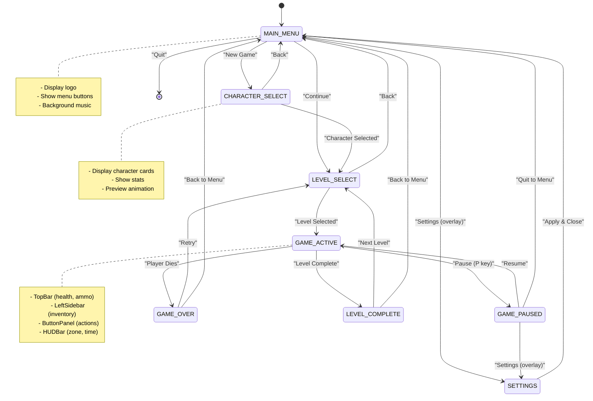

## Diagram 2: GUI Component Hierarchy

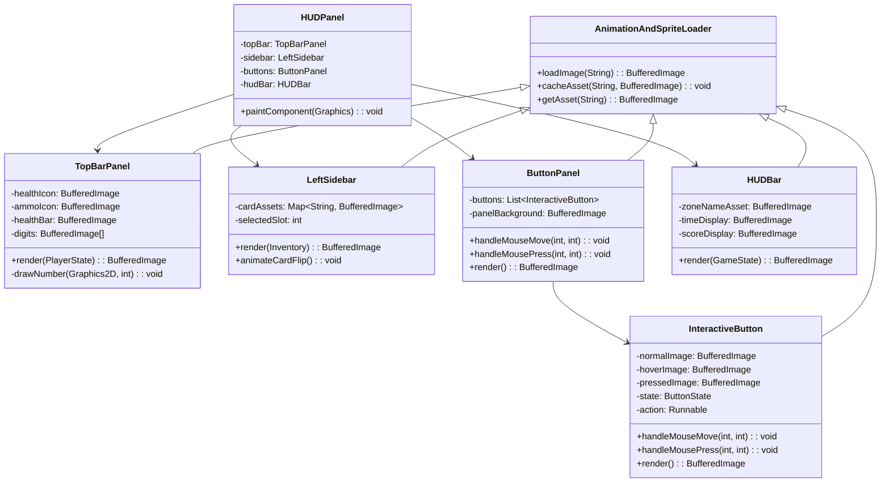

## Diagram 3: Button State Machine (Detailed)

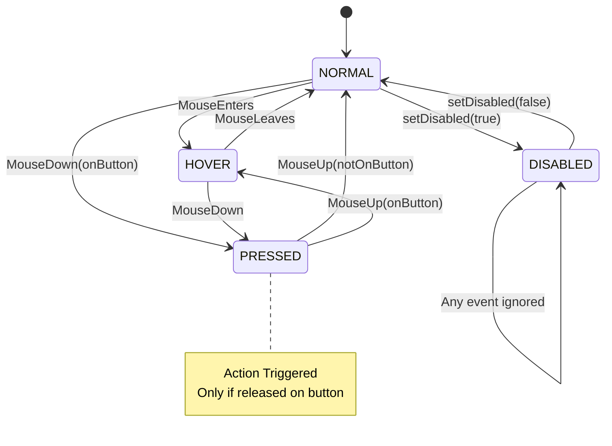

## Diagram 4: Rendering Pipeline (Frame-by-Frame)

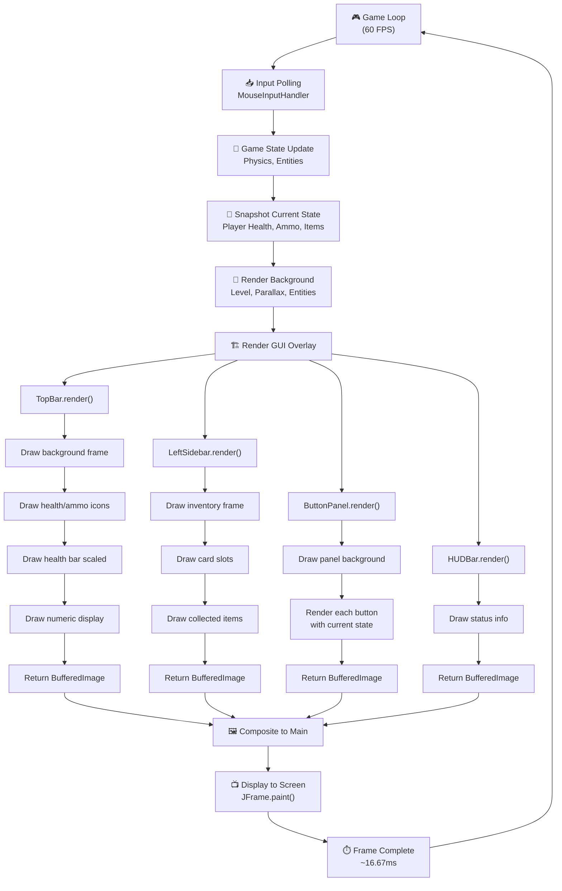

## Diagram 5: Asset Loading Architecture

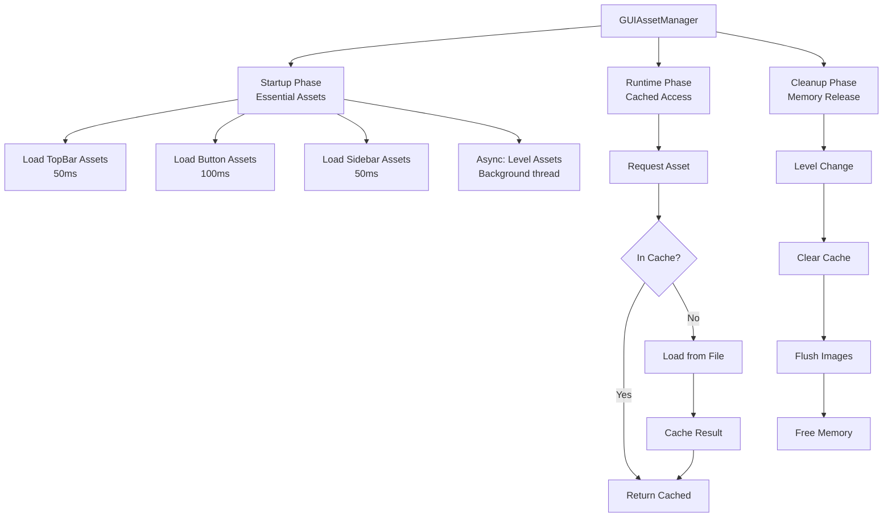

## Diagram 6: Button Construction & Lifecycle

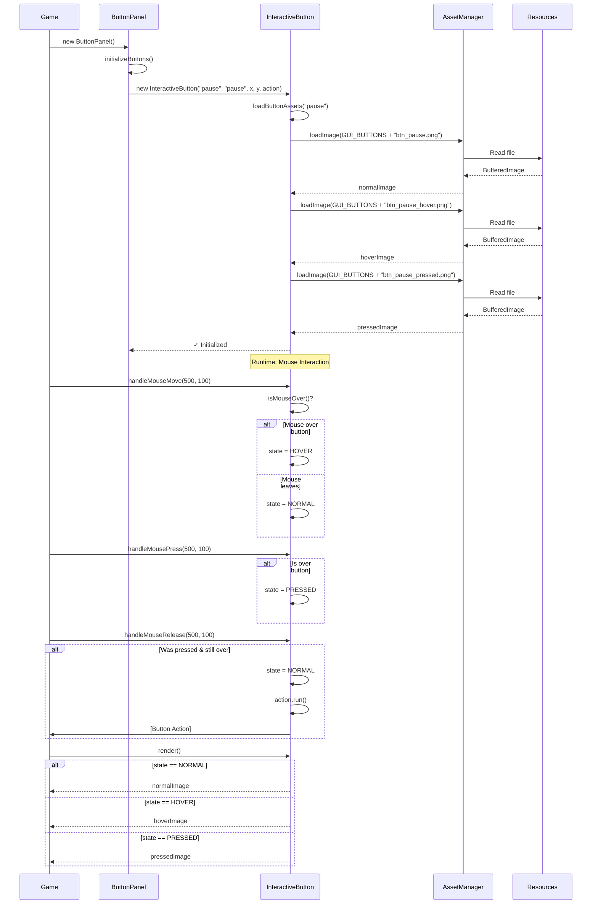

## Diagram 7: Input Event Routing

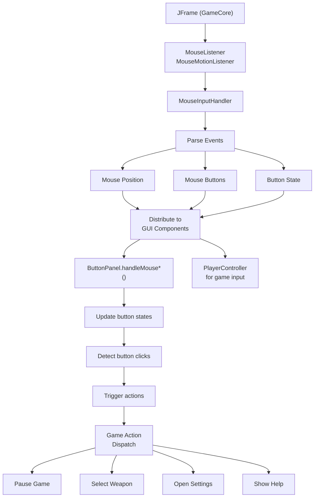

## Diagram 8: Asset Organization in Resources

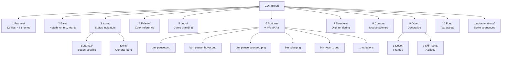

## Diagram 9: TopBar Panel Rendering Sequence

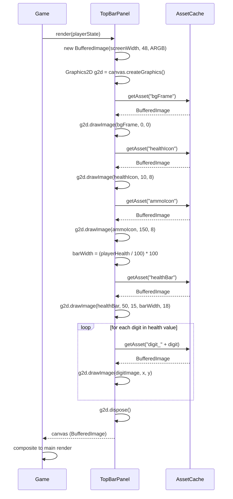

## Diagram 10: Complete Game State to GUI Mapping

```mermaid
graph TB
    MM["MAIN_MENU<br/>(MainMenuScreen)"] --> MM1["Layout: Centered"]
    MM --> MM2["Assets: Logo, Buttons"]
    MM --> MM3["Input: Menu Navigation"]
    
    CS["CHARACTER_SELECT<br/>(CharacterSelectScreen)"] --> CS1["Layout: Card Grid"]
    CS --> CS2["Assets: Character portraits"]
    CS --> CS3["Dynamic: Stat display"]
    
    LS["LEVEL_SELECT<br/>(LevelSelectScreen)"] --> LS1["Layout: Level Grid"]
    LS --> LS2["Assets: Level thumbnails"]
    LS --> LS3["Dynamic: Progress display"]
    
    GA["GAME_ACTIVE<br/>(InGameGUI)"] --> GA1["TopBar"]
    GA --> GA2["LeftSidebar"]
    GA --> GA3["ButtonPanel"]
    GA --> GA4["HUDBar"]
    
    GA1 --> GA1a["Health, Ammo display"]
    GA2 --> GA2a["Inventory grid"]
    GA3 --> GA3a["Weapon buttons"]
    GA4 --> GA4a["Zone, Time display"]
    
    GP["GAME_PAUSED<br/>(PauseMenuScreen)"] --> GP1["Layout: Centered overlay"]
    GP --> GP2["Background: Dimmed"]
    GP --> GP3["Options: Resume, Quit"]
    
    GO["GAME_OVER<br/>(GameOverScreen)"] --> GO1["Layout: Centered"]
    GO --> GO2["Dynamic: Score display"]
    GO --> GO3["Options: Retry, Quit"]
    
    LC["LEVEL_COMPLETE<br/>(CompleteScreen)"] --> LC1["Layout: Score display"]
    LC --> LC2["Dynamic: Bonus calc"]
    LC --> LC3["Options: Next, Menu"]
```

## Diagram 11: Memory Management Lifecycle

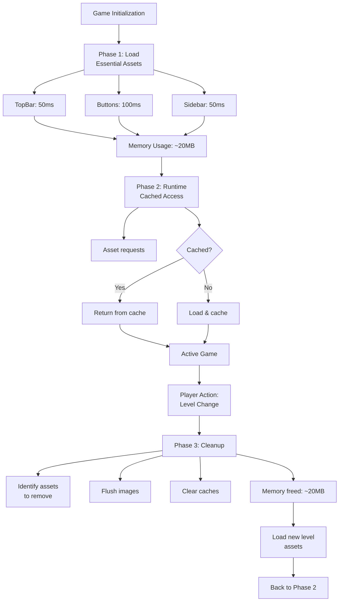

---

## Implementation Checklist

### Phase 1: Foundation
- [ ] Create `GUIAssetManager.java` (centralized loader)
- [ ] Create `AnimationAndSpriteLoaderExtension.java` (base for GUI components)
- [ ] Verify all asset paths from Resources folder
- [ ] Set up asset caching system
- [ ] Test image loading pipeline (verify no vector code)

### Phase 2: Components
- [ ] Implement `TopBarPanel.java`
- [ ] Implement `LeftSidebar.java`
- [ ] Implement `InteractiveButton.java`
- [ ] Implement `ButtonPanel.java`
- [ ] Implement `HUDBar.java`
- [ ] Test each component independently

### Phase 3: Screens
- [ ] Implement `MainMenuScreen.java`
- [ ] Implement `CharacterSelectScreen.java`
- [ ] Implement `LevelSelectScreen.java`
- [ ] Implement `PauseMenuScreen.java`
- [ ] Implement `GameOverScreen.java`
- [ ] Implement `LevelCompleteScreen.java`

### Phase 4: Integration
- [ ] Wire input handlers
- [ ] Connect state machine
- [ ] Test all transitions
- [ ] Verify button actions

### Phase 5: Polish
- [ ] Add animations
- [ ] Add visual effects
- [ ] Performance optimization
- [ ] Memory profiling

---

## Key Principles (Never Violate)

✅ **Use ONLY image assets** - No Graphics2D drawing  
✅ **Extend AnimationAndSpriteLoader** - Reuse base functionality  
✅ **Real asset paths** - Use GUI_BASE constants  
✅ **State-driven rendering** - GUI changes with game state  
✅ **Efficient caching** - Load once, use many times  
✅ **Clean input handling** - Mouse → ButtonPanel → Game  

❌ **NO vector graphics** - fillRect, drawString, etc.  
❌ **NO hardcoded dimensions** - Use asset actual sizes  
❌ **NO placeholder colors** - No Color-based fallbacks  
❌ **NO mixing paradigms** - Pure image-based only  
